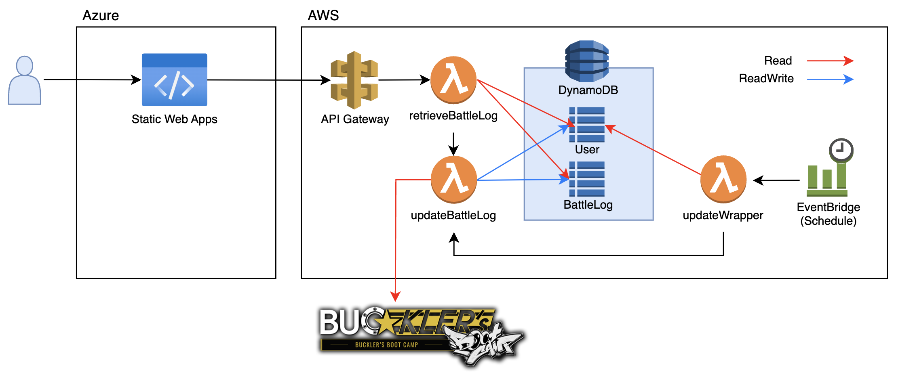

# SF6 Viewer

  

[SF6 Viewer](https://orange-bay-0720d2e00.4.azurestaticapps.net/)は指定したユーザーの過去１週間の勝率を表示するアプリケーションです。  
集計の元となる対戦情報のデータはカプコンの[BUCKLER'S BOOT CAMP](https://www.streetfighter.com/6/buckler/ja-jp)から取得しています。（カプコンに怒られたらすぐに公開停止します）

## アプリケーション概要

SF6 Viewerはフロントエンドとバックエンドから構成されます。

- フロントエンド  
Microsoft Azure Static Web Apps上で動作するReactアプリケーションです。ソースはこのGitHubリポジトリで管理されています。GitHub Actionsにより自動ビルド・自動デプロイが行われます。
- バックエンド  
AWS(Lambda, DynamoDB, API Gateway, EventBridge)上に構築しています。Lambdaの実装言語はPythonです。ソースはこのGitHub上のlambdaディレクトリ以下で管理されています。デプロイは手動です。  
- 全体アーキテクチャ図  


## 特記事項

- BUCKLER'S BOOT CAMPから取得可能な対戦情報のデータは過去100件分のみであることから、全ての過去のデータを保持するためにDB(AWS DynamoDB)を配置しています。また、BUCKLER'S BOOT CAMPから定期的にDBにデータを取得するバッチ処理を用意しています。（100試合に最速で４時間弱かかるため、バッチ処理は３時間毎に実行）
- フロントエンドは対戦情報の取得元としてこのDBを使用しています。
- データを取得する対象のユーザーリストを保持するテーブル(User)を配置しています。バッチ処理ではこのユーザーリストにあるユーザーについてのみ対戦情報の取得を行います。また、リストにないユーザーがツールを実行した場合は即時で対戦情報（直近100件）の取得を行い、ユーザーをこのリストに追加します。（これにより３時間ごとの更新対象に含まれるようになります）
- DBを更新するLambda関数には重複実行を防ぐための仕組みは用意していません。  
  これは以下の理由によります。
  - update処理は冪等性が担保されているため重複して実行されても問題ない。
  - 登録対象レコードは最新のレコードより新しいものという条件で抽出している。登録されていない未来の時間が取得されることはないため登録漏れは発生しない。
- バッチ処理で更新するユーザーの数に上限を設けています。初期値は30です。（無料枠内で運用するためのコスト上の制約）
- CI環境でのビルドの警告を無視しています。Reactのプロジェクトがデフォルトで警告を出力してしまうためです。（無視しないとGitHub Actionsによるビルドが失敗する）
- DB(BattleLogテーブル)のオートスケーリングは無効としています。Capacity Unitは下記の通りです。（無料枠内で運用するためのコスト上の制約）
  - Write Capacity Unit (WCU) = 5
  - Read Capacity Unit (RCU) = 5

## BUCKLER_IDの更新について

Lambda関数(updateBattleLog)の実行では、環境変数に有効な `buckler_id` が設定されていることを前提としています。  `buckler_id` は一定期間で有効期限が切れるため、期限が切れたらログインを行って新しい `buckler_id` を取得し、Lambdaの環境変数に設定する必要があります。

この目的のため、以下のスクリプトを用意しています。

```shell
scripts/update-buckler-id.sh
```

Note:

- パスワードは`update-buckler-id-secrets.sh`に直接記載。（GitHubにはテンプレートのみ登録）
- playwright (python) を使用してログイン操作をエミュレート。
  - インストール方法

  ```bash
  pip install playwright
  playwright install
  ```
